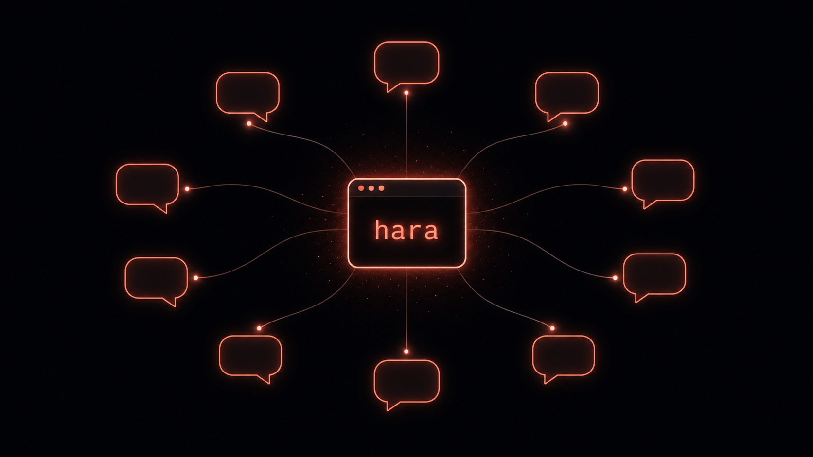

# hara

**A coding agent CLI that runs like an engineering org.**



> Think "Claude Code, but it operates as a configurable, governed *organization* of role-agents" —
> with routing boundaries, a dispatcher, a single source-of-truth data layer, human-in-the-loop
> approvals, and cron autonomy.

[](https://www.npmjs.com/package/@nanhara/hara) · TypeScript · local-first · Apache-2.0

**Highlights**
- **An org, not just an agent** — `hara org "<task>"` routes work to the role that *owns* it; `hara plan "<task>"` decomposes a task into a verified DAG of atoms (frame → atomize → sequence → execute → **verify gate**), and `hara plan --parallel` runs independent atoms concurrently.
- **Drive it from chat** — `hara gateway` runs your local hara from **Telegram · WeChat · Discord · Feishu/Lark · Slack · Mattermost · Matrix · DingTalk · WeCom · Signal** (10 platforms), with **two-way images where the platform has a byte-upload API**, resumable per-chat sessions, project/agent roaming, bounded per-thread queues, and approval-gated group automations. Connects out — no public webhook. See **[docs/gateway.md](docs/gateway.md)**.
- **Real terminal UX** — an **ink TUI**: bottom-pinned input box, **plan mode** (read-only investigation → the model submits its plan via `exit_plan` → approve → execute), selectable approvals with "don't ask again", windowed reasoning, **paste images** (Ctrl+V) for vision models, light/dark theme.
- **Persistent memory + auditable self-evolution** — `memory_*` tools over global/project `MEMORY.md`; the agent recalls before acting and can curate evidence-backed facts/preferences plus verified reusable skills. `/evolve status|now` shows or runs the bounded curation policy; it never grants permission to rewrite product code, permissions, config, or system prompts. Inspect/consolidate with **`hara memory show`** and **`hara memory distill`**. Lexical-first by design — semantic search is opt-in, never required.
- **Multi-provider, all streamed** — Anthropic (Claude) or any OpenAI-compatible endpoint (Qwen/DashScope, GLM, Kimi, OpenAI) with live Markdown + visible reasoning.
- **Delegate to other agents** — the **`external_agent`** tool hands a self-contained task to **Claude Code** or **Codex** running headless, and returns the result — so you pick the best engine per task. It is a trusted extension outside Hara's protected-file boundary: every interactive call requires confirmation, and non-interactive use is disabled by default.
- **Honest under a slow network** — a live "waiting for the model… Ns" status, a stall watchdog that
  auto-fails-over instead of hanging, terminal-native bracketed paste, big pastes folding to a token, and a
  startup update notice — the terminal never feels dead.
- **Solid coding core** — `edit_file` / `apply_patch` (atomic multi-file) with colored diffs · `grep`/`glob`/`ls`/`codebase_search` (lexical + optional semantic search over the repo) /`web_fetch` · fuzzy `@file` · `/undo` · `/compact` · **Esc-to-interrupt** · parallel sub-agents · MCP client · macOS sandbox.

Track it: https://github.com/hara-cli/hara · https://hara.run

## Install

The npm package requires **Node.js 22.12 or newer**. If needed, upgrade first with
`nvm install 22 && nvm use 22`. Node.js 20 is end-of-life and is not a supported Hara runtime.

```bash
npm i -g @nanhara/hara
```

Or a **standalone binary** (no Node required):

```bash
curl -fsSL https://raw.githubusercontent.com/hara-cli/hara/main/install.sh | sh
```

Tab completion (optional): `eval "$(hara completions zsh)"` in your `~/.zshrc` (or `bash`/`fish`).

Or in **Docker** — run hara against any repo without installing Node, and as an isolated/ephemeral
environment (handy for CI):

```bash
docker run --rm -v "$PWD:/workspace" -e HARA_API_KEY=sk-... ghcr.io/hara-cli/hara -p "summarize this repo"
# interactive TUI:
docker run --rm -it -v "$PWD:/workspace" -e HARA_API_KEY=sk-... ghcr.io/hara-cli/hara
# or build it yourself: docker build -t hara . && docker run --rm -v "$PWD:/workspace" -e HARA_API_KEY=sk-... hara
```

Or from source:

```bash
git clone https://github.com/hara-cli/hara && cd hara
npm install        # builds via the prepare script
npm install -g .   # or: npm link
```

If a source checkout linked before 0.122.1 later reports `zsh: permission denied: hara`, the old npm
link is still targeting the now-internal `dist/index.js`. Activate the same Node installation that owns
the link, run `npm link` again from this directory, then run `rehash`. `npm run build` and
`npm run doctor:local-link` detect this stale link and print its exact owning bin directory. Do not repair
it with `chmod`; the guarded executable entry is `runtime-bootstrap.cjs`.

## Quickstart

```bash
npm i -g @nanhara/hara
hara login qwen          # free Qwen OAuth  (or: export ANTHROPIC_API_KEY=…)
cd your-project
hara                     # offers to write AGENTS.md, then drops you into the TUI
```

Then just type a task — e.g. `fix the null check in @src/login.ts and run the tests`.
**shift+tab** cycles approvals (incl. **plan mode**) · **Esc** interrupts · `@`+Tab attaches a file · `/exit` quits.

One-shot, no REPL:

```bash
hara -p "summarize @README.md and list any TODOs"
```

## Setup

The fastest path is **`hara setup`** — an interactive wizard for provider + key + model (it also runs
automatically the first time you start `hara` unconfigured). Or configure it yourself — hara is
**multi-provider**:

**Anthropic (default)**
```bash
export ANTHROPIC_API_KEY=sk-ant-...
```

**Qwen — free OAuth** ("Qwen Code" tier, no API key — same flow as OpenClaw)
```bash
hara login qwen      # device login: open the printed URL, approve — token auto-refreshes
```

**Qwen — DashScope API key** (Alibaba Model Studio, OpenAI-compatible)
```bash
hara config set provider qwen
hara config set apiKey   sk-...      # your DashScope model-studio key
hara config set model    qwen-plus   # or qwen-max, qwen3-coder-plus, …
# endpoint defaults to dashscope compatible-mode/v1
#
# coding-plan keys (sk-sp-…) use the coding endpoint instead:
#   hara config set baseURL https://coding.dashscope.aliyuncs.com/v1
#   hara config set model   qwen3.7-plus
#   plan models: qwen3.7-plus, qwen3.6-plus, qwen3-coder-plus, qwen3-coder-next,
#                qwen3-max-2026-01-23, glm-5, glm-4.7  (switch with -m or /model)
```

> Plan keys (Coding Plan / Token Plan) are licensed **only** for use inside AI coding agents /
> OpenClaw-type tools like hara — not Dify/n8n, API-testing tools, or direct script/backend calls.

**Any OpenAI-compatible endpoint** (GLM, Kimi, OpenAI, local servers)
```bash
hara config set provider openai
hara config set baseURL  https://your-endpoint/v1
hara config set apiKey   ...
hara config set model    ...
```

**Vision** — hara **auto-detects** whether your main model can see images. A vision model (Claude, gpt-4o,
qwen-vl, glm-4v…) gets pasted images **inline**. For a **text-only** model (DeepSeek, coding models), set a
describer — the "eyes" — and hara OCRs/describes each pasted image into text first:
```bash
hara config set visionModel qwen-vl-max   # a vision model on the same plan/key
# point it elsewhere if your endpoint doesn't serve vision:
#   hara config set visionBaseURL https://dashscope.aliyuncs.com/compatible-mode/v1
#   hara config set visionApiKey  sk-...
```
If a model's capability is unknown, hara **asks once and remembers**. In the TUI, `/vision <model>` sets the
describer and `/vision main yes|no|auto` corrects a model's detected capability.

**Reasoning effort** — dial how hard a thinking model reasons: `off` · `low` · `medium` · `high` · `max`.
```bash
hara config set reasoningEffort high     # or off / low / medium / max
```
hara expresses it the way each endpoint wants (OpenAI `reasoning_effort`, Anthropic thinking budget,
DashScope `enable_thinking`, **DeepSeek** V4 `thinking` + `reasoning_effort` where `max` genuinely raises the
effort). In the TUI, bare `/model` opens a picker — ↑↓ pick a model, **←→ set the thinking level**.

Config lives in `~/.hara/config.json`; the nearest project `.hara/config.json` may set the explicitly safe
project preferences `model`, `theme`, `vimMode`, `autoCompact`, and `reasoningEffort`. Repository config is
untrusted by default: routing/credential, hook/MCP, approval/sandbox, computer-control, and other privileged
keys are ignored with a key-name-only warning. For a repository you have reviewed, launch with
`HARA_TRUST_PROJECT_CONFIG=1` to enable all of its project keys for that process. The opt-in is captured at
startup, and project config itself must be a bounded regular file under a real (non-symlink) `.hara` directory.
Effective precedence for enabled keys is **environment > project > selected overlay > global**. Empty routing
values are ignored, so an empty project/env value cannot hide a working global credential or endpoint. Env overrides include
`HARA_PROVIDER`, `HARA_MODEL`, `HARA_BASE_URL`, `HARA_API_KEY`, and the provider key
(`ANTHROPIC_API_KEY` / `DASHSCOPE_API_KEY`).

## Use

```bash
hara                       # interactive REPL (offers to create AGENTS.md on first run)
hara init                  # analyze the project & (re)generate AGENTS.md
hara doctor                # check your setup (auth / model / node / assets / roles)
hara roles init            # scaffold role-agents (implementer / reviewer / docs)
hara org "review src/ for bugs"   # dispatch a task to the role that owns it (or --role <id>)
hara projects add shop /absolute/path/to/shop   # register an agent home
hara agents                # list global + registered project agents
hara org --role shop:reviewer "audit auth"     # run that agent at its own home
hara plan "add a /health endpoint with a test"   # decompose → sequence (DAG) → run each step + verify
hara plan --parallel "..."  # run independent atoms concurrently  ·  hara plan resume  # continue a stopped plan
hara review                 # review uncommitted changes for bugs/security/missing tests (--staged · --base main)
hara commit                 # AI commit message from staged changes, then commit (-a to stage all · -y to skip confirm)
hara index                 # build the semantic search index (after: hara config set embedProvider ollama|qwen)
hara -p "summarize @README.md and fix the lint errors in src/"   # one-shot; @path attaches a file
hara -p "extract package metadata" --schema ./schema.json         # stdout is exactly schema-valid JSON
hara -p "review the current diff" --role reviewer                 # persona + model + tool policy from the role
hara --approval auto-edit  # suggest (default) | auto-edit | full-auto   (-y = full-auto)
hara --sandbox workspace-write   # confine shell writes to the project (macOS Seatbelt)
hara --cwd /path/to/project      # explicitly select a workspace without changing your shell directory
hara -c                    # resume the most recent session in this directory
hara --profile work        # use a named profile from ~/.hara/config.json
hara -m glm-5              # pick a model
```

Run Hara from a project directory. When the current directory resolves to your Home root, Hara does not treat
the whole Home tree as a repository: project init/index and default recursive grep/glob/codebase inventory are
disabled with a `cd /path/to/project` / `hara --cwd /path/to/project` hint. Directory listing and
child-directory recursion are also refused so
the model cannot promote a discovered Home folder into an implicit project; explicitly named single files still
work. Resuming a session reuses its persisted conversation and must not trigger workspace rediscovery.

For automation, `--schema` accepts inline JSON Schema or a schema file. The model must return through the
validated `structured_output` tool; on success stdout contains only the JSON value, while diagnostics go to
stderr and missing/invalid output exits non-zero. `--role reviewer` resolves locally, `--role global:reviewer`
uses the portable global persona in the current project, and `--role shop:reviewer` runs at that registered
project home. Each form enforces the role's persona, model, `allowTools`/`denyTools`, and `readOnly` policy.

Inside the REPL: `/help` `/init` `/tools` `/model` `/approval` `/org` `/plan` `/roles` `/task` `/continue` `/new` `/evolve` `/usage`
`/doctor` `/sessions` `/undo` `/compact` `/recall` `/reset` `/exit` (type `/`+Tab to complete). `/task`
shows the active execution record; `/task clear` drops it without deleting the conversation, and `/new` starts
a new task while retaining useful thread context. Type `@` + Tab
to attach a file (fuzzy, walks subdirectories).

The interactive REPL is an **ink TUI**: a bordered **input box pinned at the bottom** — session name in
the top-right corner, approval modes + token usage + concurrency in the bottom border — with the
conversation scrolling above it. Streaming text, reasoning, tool calls, and colored diffs render as live
blocks; a spinner runs during a turn. **shift+tab** cycles the approval mode, **Esc** interrupts a running
turn, and tool approvals appear inline (y/N). **Ctrl+V** pastes an image from your clipboard (a screenshot,
or a copied image) — or drag an image file into the terminal — and it appears as a highlighted `[Image #N]`
token inline where your cursor is (backspace over it to remove it). hara auto-detects the model's capability —
a vision model sees the image directly; a text-only model routes it through a `visionModel` describer (see
Setup), shown in the header at startup. Set `HARA_TUI=0` for the classic readline REPL.

Text pasted by a modern terminal is handled as one bracketed-paste event, including multiline Claude/Codex
output and a paste immediately followed by Enter. It is inserted for review and never auto-submitted merely
because it contains newlines; malformed/incomplete frames are bounded and surfaced instead of hanging raw mode.

Each session gets a **UUID** and an **auto-summarized name** from your first message (kept verbatim, CJK
included); `hara sessions` lists them by short id, and `--resume <prefix>` accepts the short id.

Assistant output is **rendered as Markdown** (headers, bold, inline code, lists; code fences verbatim),
and a model's **reasoning** shows dimmed before the answer when available. Both are interactive-terminal
only; `HARA_MD=0` disables Markdown rendering.

**Skills** — reusable capabilities on the **agentskills.io standard** (`SKILL.md`, interoperable with Claude
Code / codex / openclaw). Drop a `~/.hara/skills/<name>/SKILL.md` (or project `.hara/skills/`) with `name` +
`description` frontmatter and Markdown instructions; the agent sees the list and calls the `skill` tool to load
a skill's full body only when it's relevant (progressive disclosure). `hara skills init` scaffolds one, `hara
skills` lists them, `/skill <id>` loads one into your next message, and the agent saves its own with
`skill_create` (`scope: project|personal`). Optional frontmatter: `when_to_use`, `allowed-tools`, `context: fork` (run as a sub-agent), `paths`.
When the agent saves a skill, secrets are **redacted** and local paths/emails **generalized** (`<project>` / `~` / `<email>`),
and a near-duplicate is flagged so it updates instead of piling up. `assetCapture: off|ask|auto` controls proactive end-of-session capture.

**Plugins** — bundle skills + roles + MCP servers in one installable unit (Claude-Code-compatible
`plugin.json` / `.claude-plugin/`). `hara plugin add file:<path> | github:<owner/repo> | git:<url>` installs it;
`hara plugin` lists; `enable`/`disable`/`remove`. A plugin's skills/roles/MCP auto-contribute (your project &
global override them). `.claude/agents/*.md` subagents load as roles too.

**Recall** — `hara recall --init` creates a personal `~/.hara/code-assets` library (snippets as `*.md`);
`hara recall "<query>"` searches it **plus your skills** (one corpus), and `/recall <query>` pulls the best
matches into your next message. A git-versionable library of code/patterns you want to reuse (`HARA_ASSETS` overrides the path).

**Semantic search** (opt-in) — `codebase_search`, `recall`, and `memory_search` can find things by *meaning*,
not just keywords. By default they're lexical (zero setup). Configure an embedding provider, then build an index:
`hara config set embedProvider ollama` (local & offline, e.g. `bge-m3`/`nomic-embed-text`) or `qwen` (DashScope),
then `hara index` (repo, for `codebase_search`) / `hara index --assets` (code-assets, skills & memory) / `hara
index --all`. A query like "read an image pasted from the clipboard" then surfaces `src/images.ts` even with no
shared words. Indexes are rebuildable `.hara/index/` artifacts (self-`.gitignore`d, never committed); no native
vector DB needed, and lexical still works when there's no index. Re-running `hara index` is **incremental** —
only changed files re-embed (a full repo rebuild that takes ~a minute re-runs in well under a second).

**Approval modes**: `suggest` confirms edits & shell · `auto-edit` auto-applies file edits but confirms shell · `full-auto` runs everything.
**Protected files and shell sandboxing**: built-in file, search, and context paths hard-reject `.env`/credential/private-key/private-Hara-state files before the ordinary approval/dispatch path can authorize them. Safe templates (`.env.example`, `.env.sample`, `.env.template`) remain readable. `HARA_ALLOW_SENSITIVE_FILES=1` is an explicit one-process exposure switch: it removes these built-in denies and that process's shell protected-read mask. Shell subprocesses receive a scrubbed environment; explicitly retain a named inherited variable with `HARA_SUBPROCESS_ENV_ALLOW=NAME[,NAME]` (output is still redacted). With the protected-file policy enabled, shell preflight rejects literal protected paths and environment-dump commands on every OS. On macOS, Seatbelt also masks existing protected files/directories from the shell and `--sandbox workspace-write|read-only` provides **file-write confinement**. Linux/Windows have no equivalent kernel read mask: static shell preflight is a useful guardrail, not a security sandbox, and arbitrary code can bypass it.
**Screen control** (opt-in): the `computer` tool drives desktop software (screenshot → click/type), native per OS
(mac `screencapture`+`cliclick` · Windows PowerShell · Linux `scrot`+`xdotool`). Off by default — enable a tier with
`hara config set computerUse read|click|full` and allowlist apps with `hara config set computerApps "App, …"`. Guarded
by the tier, the frontmost-app allowlist, a dangerous-key blocklist, and a once-per-session grant. Screenshots are read via your
vision model into **actionable** output — interactive elements + positions (pass `focus` to target what you're after) — so even a text-only main model can click.
**Sessions and task execution**: conversations are saved automatically — `-c` / `--resume <id>` or
`hara resume <id>` to continue, `hara sessions` to list, `hara export [id] [--out file]` to render one as a
Markdown transcript. The current task is persisted separately with stable task/turn identity and recovers as
paused rather than being inferred from chat text. At idle, ordinary input starts a new task; an explicit
`继续` / `continue` / `resume` / `go on` resumes the paused objective, while `/new` forces a clean task boundary.
Type-ahead Enter steers the exact live turn; `/next <message>` queues a separate task after it. Desktop/serve
clients use `session.steer` with `expectedTurnId` (durable before ACK) and may pass `newTask: true` to force a
new execution. The `hara resume` launcher preserves terminal input in both npm/Node and standalone-binary
installs.
**MCP**: add an `mcpServers` map to global config (a reviewed project config additionally needs `HARA_TRUST_PROJECT_CONFIG=1` at launch); their tools appear to the agent as `mcp__<server>__<tool>`. Configured MCP servers, like `external_agent`, are trusted host extensions outside Hara's protected-file boundary. Every interactive tool call requires confirmation (even in `full-auto`), and non-interactive runs disable them by default; reviewed automation can explicitly opt in before launch with `HARA_ALLOW_TRUSTED_EXTENSIONS=1`. hara can also **be** an MCP server — `hara mcp` exposes its read/search tools (esp. **`codebase_search`**) over stdio so other clients (Claude Desktop, Cursor, another hara) can use them; read-only by default (`HARA_MCP_TOOLS` to override).
**Vim mode**: `hara config set vimMode true` makes the prompt modal — Esc → normal, `i/a/A/I` insert, `h l 0 $ w b e` motions, `x D C dd cw p` edits. Off by default.
**Scheduled tasks**: `hara cron add "0 9 * * 1-5" "<task>"` (or `"every 30m"`, `"in 2h"`) runs a task on a schedule — each run is a fresh hara session. `hara cron install` wires a per-minute tick into launchd/crontab (no daemon); `--org` routes through the role org. Manage with `hara cron list/run/enable/disable/remove/logs`. Every job has a 30-minute deadline and the whole sequential tick has a non-renewable 60-minute watchdog: a job timeout kills its process tree, records `timed out` + duration/error, then continues with the next due job; a tick timeout stops the remainder and releases the global lock. Add `--deliver feishu:<chatId>` (or Telegram/webhook) for outcomes and `--alert-after N` for the consecutive-failure 🚨 threshold (default 3). Delivery intent is durable before transport, uses a stable idempotency key, and retries with bounded backoff on later ticks until confirmed. A failed channel cannot grow `jobs.json` forever: each job keeps at most 64 pending effects, reserves outcome/alert room before launch, and disables itself with a visible backlog error when full; restore delivery, let the queue drain, then re-enable it. Tune milliseconds with `HARA_CRON_JOB_TIMEOUT_MS` (hard max 24h) and `HARA_CRON_TICK_TIMEOUT_MS` (hard max 5h); scheduled jobs are also capped by the tick. After upgrading from a version whose tick is already stuck, terminate that specific legacy `hara cron tick` process tree once (or reboot); the next scheduler minute marks over-age state interrupted/disabled and recovers the lock without replaying a possibly orphaned task.
**Work coordination**: `todo_write` is the agent's short, session-scoped checklist; it persists with that
session and is isolated between simultaneous sub-agents and serve sessions. `task` is the durable project pool
for work that outlives a conversation: add/update/list/remove items with `pending|in_progress|done`, an optional
owner, and `blockedBy` dependencies. The private, atomic store is shared by concurrent hara processes for the
same project and rejects missing/self/cyclic dependencies.
**Notifications**: `hara config set notify bell` (terminal bell) or `notify system` (OS notification) pings you when a turn finishes — handy for long runs you've stepped away from. Gated on elapsed time so quick turns stay quiet; off by default.
**Run limits and loop alarms**: every agent turn has a non-renewable 30-minute total deadline and a 64-round
model/tool cap. Hara warns after five minutes or at 75% of the round budget, stops the third identical failing
tool call, and surfaces the final reason in CLI, Desktop, or gateway output. Tune intentional long work with
`hara config set runTimeoutMs 45m` (1s..2h) and `hara config set maxAgentRounds 96` (1..256), or
`HARA_RUN_TIMEOUT_MS` / `HARA_MAX_AGENT_ROUNDS`; neither boundary can be disabled. Sub-agents are capped at
8 minutes/24 rounds and inherit the parent's cancellation. Auxiliary model work (planning, verification,
compaction, naming, commit messages, the guardian, and vision) has its own short hard deadline as well, so a
provider that ignores cancellation cannot strand the CLI outside the main loop.
**Hooks**: run your own shell commands around tool calls via a `"hooks"` map in global config; hooks from a reviewed project config require the launch-time `HARA_TRUST_PROJECT_CONFIG=1` opt-in. A **`PreToolUse`** hook can **veto** a call (non-zero exit blocks it; its output becomes the reason the model sees) — gate `bash`, forbid edits outside a path, require a clean tree. A **`PostToolUse`** hook observes (format/lint a file the agent just wrote, log, notify). Each has a `matcher` (regex/literal on the tool name, `*` = all) and gets `{tool, payload}` on stdin + `HARA_TOOL_NAME` in env. Plugins can contribute hooks too.
Reviewer/read-only/plan runs and parallel read-only sub-agents suppress both hook phases: PreToolUse and
PostToolUse commands are arbitrary shell, so either could otherwise bypass their read-only contract indirectly.
They also skip configured and plugin-provided MCP server processes, so starting an external tool server cannot
bypass the same contract before the first model turn.
**Profiles and live config**: select an identity with `--profile <name>`; use `overlays` in
`~/.hara/config.json` for named config overlays. Project `.hara/config.json` files get the safe preference
allowlist above; project-specific routing requires `HARA_TRUST_PROJECT_CONFIG=1` before launch.
`.hara-profile` identity pins are read no-follow with size, single-inode, and hard-link checks; pin updates use
an atomic compare-and-swap, and invalid-pin warnings never echo file contents or paths. A Git-tracked pin is
repository-controlled and ignored by default; local untracked pins created with `hara profile pin` work
normally. The same launch-time `HARA_TRUST_PROJECT_CONFIG=1` opt-in enables a reviewed tracked pin.
Long-lived `hara serve` processes reload provider credentials/routes and guardian settings for the target cwd on
new sessions and turns. `models.list` and new sessions see current defaults; a resumed session keeps its explicit
model pin while using the live provider route. No server restart is required after a credential rotation.

### The org — what makes hara different

Define role-agents in `.hara/roles/*.md` — each is a persona (the file body) plus frontmatter: `owns`
(keywords that route a task here), optional `rejects`, `model`, and `allowTools`/`denyTools`. `hara org
"<task>"` routes the task to the role that **owns** it (keyword match, LLM fallback) and runs that role's
agent — e.g. a read-only `reviewer` that reports issues vs an `implementer` that edits code. `hara roles`
lists them, `hara roles init` scaffolds a starter set, and `--role <id>` forces a specific role. Add
**`--review`** and the org works like a team: the owning role implements, then a **reviewer** role inspects
the diff and either approves or sends it back with fixes — looping implement → review → fix until approved
(or `--rounds N`). Add **`--commit`** and it commits the approved result with an AI-written message (guarded
to a clean start tree; a review that doesn't pass leaves the work uncommitted). The
**`agent`** tool spawns **parallel read-only sub-agents** for fan-out — analyze / review / search
several things at once (each can take a `role`), bounded to 8 concurrent (`HARA_MAX_CONCURRENCY`).

Register project homes with `hara projects add <name> <absolute-path>`, then `hara agents` becomes a global
address book across `~/.hara/roles` and each registered project's roles. A qualified address such as
`shop:reviewer` is unambiguous; both `hara org --role shop:reviewer "<task>"` and one-shot `hara -p "<task>"
--role shop:reviewer` execute at that agent's home, with its own `AGENTS.md`, live project config, role model,
and allow/deny/read-only tool policy. `global:<name>` is portable and runs in the current project. A bare name
uses the local role first and otherwise must resolve unambiguously.

Beyond routing, **`hara plan "<task>"`** makes the org *plan*: it decomposes the task into atoms,
sequences them as a DAG, and executes each step (optionally routed to a role) behind a per-step
**verify gate** — frame → atomize → sequence → execute → verify. Each atom may carry a `check` shell
command, so verification is **objective** (e.g. `npm test`, `tsc --noEmit`) rather than a
self-assessment. Plan state is the SSOT at `.hara/org/plan.json` (inspectable; execution stops on the
first failed verification — fix it and **`hara plan resume`** continues, skipping the atoms already done).
With **`hara plan --parallel`**, independent atoms (the same dependency wave) run **concurrently** — the org
works the independent parts at once, not one step at a time.

### What it can do

A streaming agentic loop with built-in tools — `read_file`, `write_file`, **`edit_file`** /
**`apply_patch`** (surgical edits — single file, or **atomic multi-file** changes), `bash`, and
read-only **`grep`** / **`glob`** / **`ls`** / **`web_fetch`** — behind a human-in-the-loop confirmation gate on the
dangerous ones unless `-y`. Read-only tools run in parallel within a turn, and edits print a
**colored diff** of what changed. Shell output streams live; press **Esc** to interrupt a running
turn, or **`/undo`** to revert the last edit. In-session **`/diff`**, **`/review`**, and **`/commit`** close the change → review → commit loop without leaving the prompt.
- **Explicit live steering vs next-task queue**: keep typing while hara works and press Enter to fold a clarification into the next model call; use `/next <message>` to queue a separate task behind the live one. Accepted Desktop steering is persisted before ACK; **Esc** drops the local queue and stops.
- **Bounded context + checkpoint compaction**: each provider call receives a non-destructive budgeted snapshot (old tool payloads/images cannot monopolize context). Overflow retries once with a tighter snapshot; `/compact` creates a structured execution checkpoint and retains the latest three user-turn groups plus current touched-file content.
- **Project context**: auto-loads `AGENTS.md` (the cross-tool standard) walking up to the repo root; `hara init` writes one by analyzing the repo.
- **`@file` mentions**: attach file contents to a message (`@path`); Tab-completes with a **fuzzy** matcher over the project (subdirs, git-tracked + untracked) — `@idx` → `src/index.ts`. `@<dir>` loads a directory listing, `@src/`+Tab drills into a folder, and mistyped tool/file paths get a "did you mean" suggestion.
- **Explicit workspace boundary**: launching at Home does not inventory its directories or permit coding mutations. Start Hara from a concrete project, or pass `hara --cwd /path/to/project`, to enable search, `@` completion, shell/external agents, and file edits; explicitly named single-file reads remain available at Home.
- **Multi-provider**: Anthropic (Claude) or any OpenAI-compatible endpoint (Qwen/DashScope, GLM, Kimi, OpenAI) — **all streamed live**.
- **Chat gateway**: drive your local hara from **Telegram · WeChat · Discord · Feishu/Lark · Slack · Mattermost · Matrix · DingTalk · WeCom · Signal**. The daemon connects out (no public webhook), with per-chat sessions, project roaming (`/cd`), agent switching (`/agent`), and **two-way images on byte-upload-capable platforms**. Setup, platform capability details, and the group-flow security model: **[docs/gateway.md](docs/gateway.md)**.

### Roadmap

**Shipped:** ink TUI · plan mode · persistent memory + self-evolution · atomization planner · parallel plan atoms · **multi-role review chains** · global project-agent index · durable project tasks · parallel sub-agents · MCP client *and* server · **scheduled tasks (`hara cron`)** · **chat gateway (10 platforms, capability-aware media)** · **single-binary distribution** · **Docker image** · `/compact` context management.
**Next:** SSOT data authority · an enterprise control-plane (fleet + central token management).

## Security

Human-in-the-loop by default, with a layered model (approval gate · read-only sub-agents · write-confinement sandbox · `web_fetch` SSRF guard · `0600` secrets · reviewed plugin trust). Threat model, controls, and how to report a vulnerability: **[SECURITY.md](SECURITY.md)**.

## License

Licensed under the **Apache License 2.0** ([LICENSE](LICENSE)) — a permissive license with an
explicit patent grant. Contributions per [CLA.md](CLA.md).

© 2026 Nanhara
